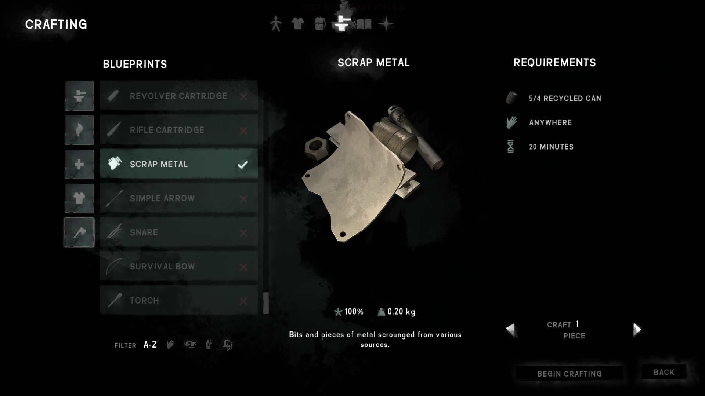

# TinCanImprovements

A mod for *The Long Dark* that improves tin cans, based loosely on my old *BreakDownCans* mod.

## Features

- Allows you to craft 4 tin cans into 1 scrap metal
- Reduces the weight of tin cans to 0.05 kg (I weighed some cans IRL)
- Fixes some issues with the weight of food items becoming less than the weight of the tin can

## Installation

1. If you haven't done so already, install MelonLoader by downloading and running [MelonLoader.Installer.exe](https://github.com/HerpDerpinstine/MelonLoader/releases/latest/download/MelonLoader.Installer.exe)
2. Download the latest version of `TinCanImprovements.dll` from the [releases page](https://github.com/zeobviouslyfakeacc/TinCanImprovements/releases)
3. Move `TinCanImprovements.dll` into the Mods folder in your TLD install directory

## Screenshots

